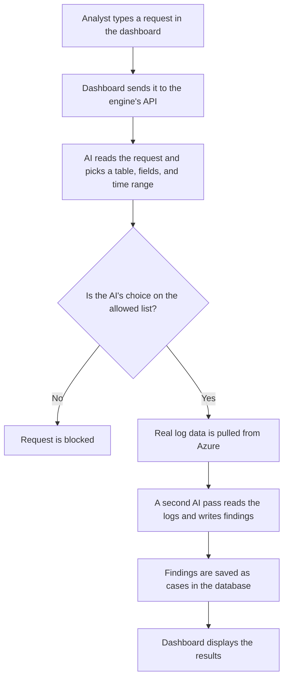

# Agentic SOC Dashboard 

## What this is

This is a web dashboard built on top of an existing AI threat hunting engine. The engine already worked on its own as a command line tool. It could query security logs and use AI to analyze them, but it only ran in a terminal. This dashboard sits on top of that engine. It makes it easier to search, review, and document findings, and it brings useful tools like file reputation checks directly into the interface instead of requiring separate manual steps.

## Capabilities

- Natural language threat hunting, no special query syntax required
- Findings automatically mapped to MITRE ATT&CK tactics and techniques, with a confidence rating
- Case lifecycle tracking, moving a finding through open, investigating, resolved, or ignored
- A permanent analyst notes thread on every case
- File hash reputation checks against VirusTotal
- Real AI cost tracked per hunt, based on actual token usage rather than an estimate
- Cross case pattern views, showing which attack techniques show up most often

## Platform stack

- Python
- FastAPI
- SQLite
- OpenAI API
- Azure Log Analytics
- Microsoft Defender for Endpoint
- Next.js (React + TypeScript)
- Tailwind CSS
- VirusTotal API

## Setup and what each piece does

### Python and FastAPI

The engine started as a plain Python script that only worked if you ran it directly in a terminal. FastAPI is a Python package that turns regular functions into web addresses a browser can call. Installing it is what allowed a website to trigger a hunt instead of only being able to run it from a terminal.

Uvicorn is the program that actually runs the FastAPI app and keeps it listening for requests. FastAPI defines what should happen. Uvicorn is what's running in the background and answering when a request comes in.

### SQLite

SQLite comes built into Python, so it didn't need a separate install. It's the database that stores every case, every analyst note, and the cost of every hunt. It's what gives the tool a memory. Before this, results just printed to the screen once and were gone.

### The requests library

This is a small, common Python package used for making calls to other services online. It's what lets the backend reach out to VirusTotal and ask whether a specific file hash has been seen before.

### Node.js

Node.js lets JavaScript run outside of a browser. It's needed because the dashboard itself, built with Next.js and React, is written in JavaScript and TypeScript. Without Node.js installed, none of the frontend code can run.

### Next.js, React, and Tailwind CSS

React is the library that builds the actual interface, things like buttons, forms, and pages. Next.js is a framework built on top of React that organizes the app into pages automatically and handles a lot of setup that would otherwise need to be done by hand. Tailwind CSS is the styling system used to keep everything looking consistent without writing custom CSS for every element.

## How it fits together

The Python and FastAPI side and the Next.js side are two separate programs running at the same time. They talk to each other over the network. The dashboard sends a request, something like "run a hunt" or "give me all cases," and the engine sends back an answer. None of the engine's original logic had to change for this to work. The dashboard was built entirely as a layer on top, calling into the engine rather than replacing any part of it.

## An example of how a request moves through the system 

## Threat hunt search

---
## Threat hunt findings

---
## Results section

Every finding across every hunt, in one table.

---
## Case detail

This case is set to investigating. Status options are open, investigating, resolved, and closed.

---
## Intel section 

Tactics and techniques aggregated across all cases, clickable to see the cases behind each one.

---

## Behind the scenes flow

SOC Engine: https://github.com/Colby-hin/soc-engine
